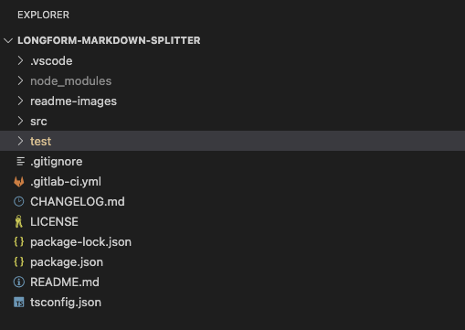
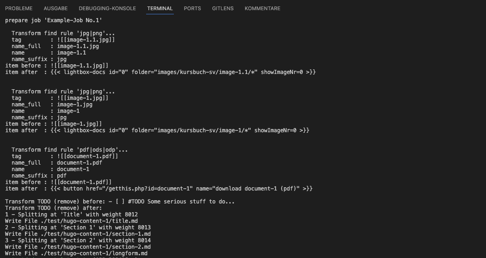

# MD-Curcuma

Copys and transforms Markdown files from your [Obsidian](https://obsidian.md/)-Vault for usage in [Hugo](https://gohugo.io).

* This thing ist done with [Typescript](https://www.typescriptlang.org/).
* Inspired by: https://github.com/accraze/split-md
* Why not [golang](https://golang.org/)? So you can use it easier outside the golang unsiverse.

It would be nice to be able to build customized transformers for different solutions.

Transformers are currently available for the following tasks:

1. Split a Longform in separate Files at Headlines
2. Obsidian-Links (Images and Documents), copy Files on the fly
3. Latex-Formulas, Paragraph an inline. 
4. Callouts
5. Remove Todos

Restrictions

* It only runs in Backend, not in Browsers.

## How ist works

```ts
// in short:
const my_exporter: MD_Exporter = new MD_Exporter();
my_exporter.perform_job_from("./transport-config.json", "Example-Job No.1");
```

All tasks are defined in the `transport-config.json` configuration file.

```ts
// in long:
const my_exporter: MD_Exporter = new MD_Exporter();

// Basic config
const exporter_parameter: MD_Exporter_Parameter_Type = {
  readPath: "test/obsidian-vault/longform.md",
  writePath: "test/hugo-content-2/",
  doSubfolders: false,
  limit: 1990,
  useCounter: false
};

// Transformer config
const parameter_images: MD_Transformer_Parameter_Type = {
  tag_obsidian_prefix: "![[",
  tag_obsidian_suffix: "]]",
  find_rule: "jpg|png",
  replace_template: `{{< image src="assets/images/{name_full}" >}}`,
  copy_task: {
    source:"test/obsidian-vault/images/",
    target:"test/hugo-content-2/assets/images/{name}/",
    simulate:simulate_copy_job
  }
};

// Add the Transformer to the pipeline
exporter.addTransformer(new MD_ObsidianLink_Transformer(parameter_images));

// execute the job
my_exporter.perform_job(exporter_parameter);
```

Take a look in the `test` folder for running examples.

# Transformations

I already have a number of transformations on offer, but if you need your own, you can and add them to the pipeline. 

## The Longform Markdown Splitter

The Problem:

* I have a long Markdown document that was compiled with the [Obsidian Longform plugin](https://github.com/kevboh/longform).
* I would like to make this available on my website.
* The website is built with [Hugo](https://gohugo.io).
* For this purpose, the longform document is to be split into several individual documents.
  * The splitting should be done on headings: e.g.: `# `
  * The text of the heading is used as the filename
  * If necessary, with a number in front, if necessary replace special characters url conform
* Be Hugo compatible.
  * The individual documents should be equipped with frontmatter.
  * autogenerate uuids
* Certain content may need to be transformed:
  * Remove heading (preferably as an option)
  * create Hugo Shortcodes for Images and Attachmemts (pdf, odf,...)
    * Insert download buttons.
  * Remove TODOs.
  * Beachte Formulas.
  * Callouts.
  * ...

### Code-Example

```ts
var splitter_frontmatter: MD_Frontmatter = new MD_Frontmatter(`---
title: "{title}"
description: ""
url: /docs/{url_prefix}-{url}/
date: {date}
draft: false
images: []
menu:
  docs:
    parent: "docs-9602b15bad02600f3883f55e2ade6b81"
    identifier: "{url_prefix}-{url}-{uuid}"
weight: {weight}
toc: true
---\n\n`);

const parameter_splitter: MD_Splitter_Parameter_Type = {
  pattern: "# ",
  cleanName: "# ",
  limit: 100,
  hasCounter: false,
  weightBase: 8000,
  url_prefix: "test-prefix",
  doRemoveHeadline: true,
  frontmatter_filename: "", // ./test/frontmatter-template.md
  frontmatter: splitter_frontmatter
};

exporter.addTransformer(new MD_Splitter_Transformer(parameter_splitter));

```

### Example JSON for usage in config-file

```json
{
  "transformer_class_name": "MD_Splitter_Transformer",
  "transformer_parameter": {
  "pattern": "# ",
  "cleanName": "# ",
  "limit": 100,
  "hasCounter": false,
  "weightBase": 8000,
  "url_prefix": "test-prefix",
  "doRemoveHeadline": true,
  "frontmatter_filename": "./test/frontmatter-template.md",
  "frontmatter": {}
}
```

## Transform Obsidian-Links

Images from 

````
![[my-image.jpg]]
````

Hugo replacement:

```
 
```

or Dokuments from

````
![[docu-1.pdf]]
````

Hugo replacement:

```

```

### Code-Example

```ts
const parameter_images: MD_Transformer_Parameter_Type = {
  tag_obsidian_prefix: "![[",
  tag_obsidian_suffix: "]]",
  find_rule: "jpg|png",
  replace_template: `{{< image src="assets/images/{name_full}" >}}`,
  copy_task: {
    source:"test/obsidian-vault/images/",
    target:"test/hugo-content-2/assets/images/{name}/",
    simulate:simulate_copy_job
  }
};

const parameter_docs: MD_Transformer_Parameter_Type = {
  tag_obsidian_prefix: "![[",
  tag_obsidian_suffix: "]]",
  find_rule: "pdf|ods|odp",
  replace_template: `{{< button href="/getthis.php?id={name}" name="download {name} ({name_suffix})" >}}`,
  copy_task: {
    source:"test/obsidian-vault/attachments/",
    target:"test/hugo-content-2/static/downloads/",
    simulate:simulate_copy_job
  }
};

exporter.addTransformer(new MD_ObsidianLink_Transformer(parameter_images));
exporter.addTransformer(new MD_ObsidianLink_Transformer(parameter_docs));
```

### Example JSON for usage in config-file

```json
{
  "transformer_class_name": "MD_ObsidianLink_Transformer",
  "transformer_parameter": {
    "tag_obsidian_prefix": "![[",
    "tag_obsidian_suffix": "]]",
    "find_rule": "jpg|png",
    "replace_template": "{{< lightbox-docs id=\"0\" folder=\"images/kursbuch-sv/{name}/*\" showImageNr=0 >}}",
    "copy_task":{
      "source":"test/obsidian-vault/images/",
      "target":"test/hugo-content-2/assets/images/{name}/",
      "simulate":false
    }
  }
},
{
  "transformer_class_name": "MD_ObsidianLink_Transformer",
  "transformer_parameter": {
    "tag_obsidian_prefix": "![[",
    "tag_obsidian_suffix": "]]",
    "find_rule": "pdf|ods|odp",
    "replace_template": "{{< button href=\"/getthis.php?id={name}\" name=\"download {name} ({name_suffix})\" >}}",
    "copy_task":{
      "source":"test/obsidian-vault/attachments/",
      "target":"test/hugo-content-2/static/downloads/",
      "simulate":false
    }
  }
},
```

### Copy images and documents on the fly 

A simulation mode provides information about which images and attachments it expects and where. 

## Transform Latex Formulas from Obsidian-Style to Hugo-Style

* https://www.makeuseof.com/write-mathematical-notation-obsidian/
* https://getdoks.org/docs/built-ins/math/

from this Formula in a Paragraph:

```latex
$$
W_{kin} = \frac { m \cdot v^2}{2} = \frac {p^2}{ 2 \cdot m}
$$

This is an inline ${(x+y)}^2$ Formula.

```

to this

````latex
```math {.text-center}
$$
W_{kin} = \frac { m \cdot v^2}{2} = \frac {p^2}{ 2 \cdot m}
$$
```

This is an inline  ${(x+y)}^2$  Formlula.
````

### Code-Example

```ts

var parameter_math_paragraph: MD_Transformer_Parameter_Type = {
  tag_obsidian_prefix: "$$",
  tag_obsidian_suffix: "$$",
  find_rule: "",
  replace_template: "```math {.text-center}\n$$\n {content} \n$$\n```\n",
};

var parameter_math_inline: MD_Transformer_Parameter_Type = {
  tag_obsidian_prefix: "$",
  tag_obsidian_suffix: "$",
  find_rule: "",
  replace_template: " ${content}$ ",
};

exporter.addTransformer(new MD_MathParagraph_Transformer(parameter_math_paragraph));
exporter.addTransformer(new MD_MathInline_Transformer(parameter_math_inline));
```

### Example JSON for usage in config-file

```json
        {
          "transformer_class_name": "MD_MathParagraph_Transformer",
          "transformer_parameter": {
            "tag_obsidian_prefix": "$$",
            "tag_obsidian_suffix": "$$",
            "find_rule": "",
            "replace_template": "```math {.text-center}\n$$\n {content} \n$$\n```\n"
          }
        },
        {
          "transformer_class_name": "MD_MathInline_Transformer",
          "transformer_parameter": {
            "tag_obsidian_prefix": "$",
            "tag_obsidian_suffix": "$",
            "find_rule": "",
            "replace_template": " ${content}$ "          
          }
        },
```

## Translate Obsidian-Callouts to Hugo-Callout-Shortcodes

* Obsidian Admonitions https://plugins.javalent.com/admonitions/beginner/types
* Hugo Callouts https://getdoks.org/docs/basics/shortcodes/

Von 

````
> [!info] Custom Title
> Here's a callout block.
> It supports **Markdown**, [[Internal link|Wikilinks]], and [[Embed files|embeds]]!
> ![[Engelbart.jpg]]
````

* note
* abstract(summary, tldr)
* info
* todo
* tip (hint, important)
* success(check, done)
* question (help, faq)
* warning (caution, attention)
* failure (fail, missing)
* danger (error)
* bug
* example
* quote (cite)

in

```
{{ < callout context="tip" title="Custom Title" icon="rocket" > }}
 Here's a callout block.
{{ < /callout > }}
```

* context="tip"     title="Tip"     icon="rocket"
* context="note"    title="Note"    icon="info-circle"
* context="caution" title="Caution" icon="alert-triangle" 
* context="danger"  title="Danger"  icon="alert-octagon"

### Code-Example

```ts

var parameter_callouts: MD_Transformer_Parameter_Type = {
  tag_obsidian_prefix: "> [!",
  tag_obsidian_suffix: "]",
  find_rule: "",
  replace_template: `{{< callout context="{context}" title="{title}" icon="{icon}" > }} {content} `,
};

exporter.addTransformer(new MD_Callout_Transformer(parameter_callouts));

```

###  Example JSON for usage in config-file

```json
{
  "transformer_class_name": "MD_Callout_Transformer",
  "transformer_parameter": {
    "tag_obsidian_prefix": "> [!",
    "tag_obsidian_suffix": "]",
    "find_rule": "",
    "replace_template": "{{< callout context=\"{context}\" title=\"{title}\" icon=\"{icon}\" > }} {content} "
  }
},

```

## Remove TODOs

Remove for example the following Paragraphes:

````md
- [ ] #TODO Some serious stuff to do...
````

### Code-Example

```ts
const parameter_remove: MD_Transformer_Parameter_Type = {
  tag_obsidian_prefix: "",
  tag_obsidian_suffix: "",
  find_rule: "- [ ] #TODO ",
  replace_template: ``,
};

exporter.addTransformer(new MD_RemoveTODOS_Transformer(parameter_remove));
```

### Example JSON for usage in config-file

```json
{
  "transformer_class_name": "MD_RemoveTODOS_Transformer",
  "transformer_parameter": {
    "find_rule": "- [ ] #TODO ",
    "replace_template": ""
  }
},

```

# Install and Use

## Where to use?

The Transport-Scripts can be used...

1. in the Hugo-Project - and pull from Obsidian Vault.
2. in Obsidian - and push to your Hugo project. I will write an Obsidian-Plugin for that in near future.
3. as stand allone project between Obsidian and Hugo - so it does pulling and pushig.

I recommend Option `3` at the moment.

## Install it

The easiest way is to clone the repository:

* copy the link: https://gitlab.com/glimpse-of-life/longform-markdown-splitter.git 
* open VS Code
* Click on `Clone Git repository`.
* Select a directory to clone the target to.
* The directory `longform-markdown-splitter` will be created.
* Open the project in VS-Code
* Open Teriminal
* `npm install`
* `npm run test`



Another option is to create an empty project, an install from npm... 

* create a `project-folder`
* open that folder, and in it...

```bash
npm init
# follow the guide
npm install longform-markdown-splitter
# check typescript installation
tsc --version
```

create a `tsconfig.json`

If you use it inside your Hugo Project, some folders are excluded per default.

```json
{
  "compilerOptions": {
    "module": "commonjs",
    "target": "ES5",
    "noImplicitAny": true,
    "removeComments": true,
    "preserveConstEnums": true,
    "sourceMap": false,
    "baseUrl": "./",
    "rootDir":"transport-scripts",
    "outDir": "transport-scripts-compiled"
  },
  "include": ["transport-scripts/**/*"],
  "exclude": [
    "assets",
    "config",
    "content",
    "data",
    "layouts",
    "node_modules",
    "resources",
    "static",
    "transport-scripts-compiled"
  ]
}
```

Look in the `test` folder for running examples. 

Create two folders for your scripts:

* `transport-scripts` - holds the typescript source-code
* `transport-scripts-compiled`

The first is for the Typescript source-code, the second is for the Java script that will later be compiled from it.

## compile to javascript

To simplify handling, include the following build commands in the `package.json`: 

The ts suffix in `build:ts` separates it from the golag scripts which i name `build:go`, but of course you can call them whatever you like.

```json
    "build:ts": "rm -rf transport-scripts-compiled && tsc",
    "watch:ts": "tsc --watch",
```

## Create The Example Markdown-Files

* create folder `test`, and in folder test 
  * create folder `test/obsidian-fault/` - an put your longform.md in it.
  * create folder `test/hugo-content/` - this is the target directory

## Create a Transport-Script 

In folder `transport-scripts`create the file `split-my-longform.ts` and paste the code:

```ts
const my_exporter: MD_Exporter = new MD_Exporter();
my_exporter.perform_job_from("./transport-config.json", "Example-Job No.1");
```

That is all was needed when you provide a config file and a frontmatter file.

You can do it the other - the long - way:

```ts
import {
  MD_Frontmatter_Template,
  MD_ObsidianLink_Transformer,
  MD_RemoveTODOS_Transformer,
  MD_Math_Transformer,
  MD_Splitter_Parameter_Type,
  MD_Transformer_Parameter_Type,
} from "longform-markdown-splitter";
import {
  MD_Exporter,
  MD_Exporter_Parameter_Type,
} from "longform-markdown-splitter";


const exporter: MD_Exporter = new MD_Exporter();

// Basic instructions for MD_Exporter

const exporter_parameter: MD_Exporter_Parameter_Type = {
  readPath: "test/obsidian-vault/longform.md",
  writePath: "test/hugo-content-2/",
  doSubfolders: false,
  limit: 1990,
  useCounter: false
};

const simulate_copy_job = true;

// The tasks to operate. If you add no tasks you have a simple copy job.

// Placeholders in the Transformer-Template
// as pre defined in MD_Transformer_TemplateValues_Type in the md-transformer module:
// {name_full} {name_suffix} {name}
const parameter_images: MD_Transformer_Parameter_Type = {
  tag_obsidian_prefix: "![[",
  tag_obsidian_suffix: "]]",
  find_rule: "jpg|png",
  replace_template: `{{< image src="assets/images/{name_full}" >}}`,
  copy_task: {
    source:"test/obsidian-vault/images/",
    target:"test/hugo-content-2/assets/images/{name}/",
    simulate:simulate_copy_job
  }
};

const parameter_docs: MD_Transformer_Parameter_Type = {
  tag_obsidian_prefix: "![[",
  tag_obsidian_suffix: "]]",
  find_rule: "pdf|ods|odp",
  replace_template: `{{< button href="/getthis.php?id={name}" name="download {name} ({name_suffix})" >}}`,
  copy_task: {
    source:"test/obsidian-vault/attachments/",
    target:"test/hugo-content-2/static/downloads/",
    simulate:simulate_copy_job
  }
};

var parameter_math: MD_Transformer_Parameter_Type = {
  tag_obsidian_prefix: "$$",
  tag_obsidian_suffix: "$$",
  find_rule: "",
  replace_template: "```math {.text-center}\n$$\n {content} \n$$\n```\n",
};


const parameter_remove: MD_Transformer_Parameter_Type = {
  tag_obsidian_prefix: "", // TODO optional?
  tag_obsidian_suffix: "", // TODO optional?
  find_rule: "- [ ] #TODO ",
  replace_template: ``,
};

// The Markdown-Splitter Task needs a Frontmatter

// The placeholders result from the definition of MD_Frontmatter_Type in md-frontmatter
// A file definition in frontmatter_filename, overwrites frontmatter Property
var splitter_frontmatter: MD_Frontmatter = new MD_Frontmatter(`---
title: "{title}"
description: ""
url: /docs/{url_prefix}-{url}/
date: {date}
draft: false
images: []
menu:
  docs:
    parent: "docs-9602b15bad02600f3883f55e2ade6b81"
    identifier: "{url_prefix}-{url}-{uuid}"
weight: {weight}
toc: true
---\n\n`);

const parameter_splitter: MD_Splitter_Parameter_Type = {
  pattern: "# ",
  cleanName: "# ",
  limit: 100,
  hasCounter: false,
  weightBase: 8000,
  url_prefix: "test-prefix",
  doRemoveHeadline: true,
  frontmatter_filename: "", // ./test/frontmatter-template.md
  frontmatter: splitter_frontmatter
};

exporter.addTransformer(new MD_ObsidianLink_Transformer(parameter_images));
exporter.addTransformer(new MD_ObsidianLink_Transformer(parameter_docs));
exporter.addTransformer(new MD_RemoveTODOS_Transformer(parameter_remove));
exporter.addTransformer(new MD_Math_Transformer(parameter_math));
exporter.addTransformer(new MD_Splitter_Transformer(parameter_splitter));

exporter.perform_job(exporter_parameter);

```

## Compile The Transport-Script

The scripts can then be used as follows. In the terminal:

* `npm run build:ts` - build the library.
* `npm run watch:ts` - watch and compile on change to javascript.

The compiled files end up in the `transport-scripts-compiled` directory.


## Run the Script in VSCode

* In Visual Studio Code
* Go to the directory `transport-scripts-compiled`
* On the compiled `.js` file
* Mouse right klick -> Menu-Entry `Run Code`

Look in the `test` folder to check the result.


Observe the console output on the Output tab. The images and documents shown in the log have to be copied over manually at the moment. 



## Build A Custom Transformer

```ts
import { MD_Exporter_Parameter_Type } from "src/md-exporter";
import { MD_Transformer_AbstractBase } from "src/md-transformer";

interface MD_Custom_Parameter_Type {
  custom_property: string;
}

class MD_Custom_Transformer extends MD_Transformer_AbstractBase {

    parameter: MD_Custom_Parameter_Type;
  
    constructor(parameter: MD_Custom_Parameter_Type ){
      super();
      this.parameter = parameter;
    }
  
    public set_job_parameter(job_paramter: MD_Exporter_Parameter_Type): void {
      super.set_job_parameter(job_paramter); // this is a hack
    }

    transform(file_content: MD_FileContent_Interface, index: number):  MD_FileContent_Interface {

      const body_array = file_content.body_array;
      let item = file_content.body_array[index];

      // file_content.frontmatter;
      // file_content.frontmatter_attributes;

      if (body_array[index].indexOf(this.parameter.find_rule) >= 0) {
        console.log(`Transform before: ${body_array[index]}`);
        body_array.splice(index, 1);
        file_content.index = file_content.index - 1;
        console.log(`Transform after: ${body_array[index]}`);
      }

      return file_content;
    }
  }
```

You cannot currently call this Transformer from a configuration file, but only if you instantiate it in your script. But I'm still going to build something for it :-)