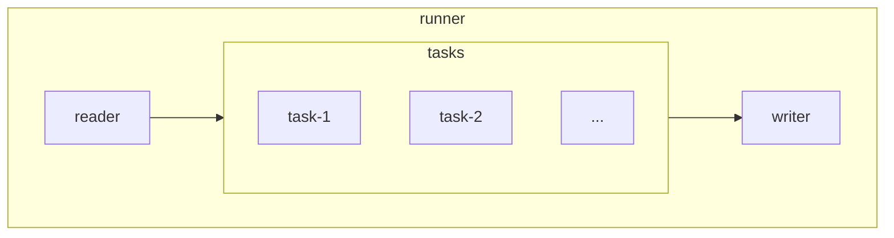

# MD-Curcuma

This is a Data-Wrangler. It copys and transforms data-files and writes. For example:

Markdown and CSV files from your [Obsidian](https://obsidian.md/)-Vault for usage in [Hugo](https://gohugo.io).

* This thing ist done with [Typescript](https://www.typescriptlang.org/).
* Inspired by: <https://github.com/accraze/split-md>
* Why not [golang](https://golang.org/)? So you can use it easier outside the golang universe.

## What is in the box?

### Availible Reader and Writer

1. Markdown - for Markdown Files.
1. CSV - For files with comma-separated values, where each line is a record. This is a [BookBuddy App](https://www.kimicoapps.com/bookbuddy) support: CSV-File conversion & Image Download.
1. XLSX - read, write and transform (upcoming).
1. Json
1. ...

### Availible Tasks

#### Markdown

1. Copying and transforming one or more Markdown files.
1. Split Markdown longform documents into several individual documents.
1. Obsidian-Links (Images and Documents), copy Files on the fly.
1. Latex-Formulas, Paragraph and Inline.
1. Frontmatter: Add, Replace, Map and Transform Values.
1. Callouts.
1. Remove Todos.
1. TODO: Take wikilinks (cross-references) into account. Footnotes Endnotes support.

### Availible Mappings

1. Adopt Value - a simple pass through example.
1. ArrayJoin, ArraySplit
1. Boolean Inverse
1. Image Downloader
1 . Insert Date (now)
1. Insert UUID
1. Trim Characters from String.

You can build customized transformers and Mappers for different solutions. For planned features and changes take a look into the [CHANGELOG.md](https://github.com/cnichte/md-curcuma/blob/main/CHANGELOG.md)

### Broken Link Checker

Bases on the great [Linkinator](https://www.npmjs.com/package/linkinator), adds some features:

* Exports the result as JSON, providing a [data source](https://gohugo.io/content-management/data-sources/) for [Hugo](https://gohugo.io)
* Limit the scan to 'extern', 'intern' or scan 'all'.
* Write each scan to a different file
* have some special_excludes.

For usage refere to the `broken-links-checker.test.ts`

### Restrictions

* It only runs in Backend, not in Browsers.
* Reading and writing is not arbitrary - (but should be).

## How it works

After the redesign its quite straight forward:

> [!IMPORTANT]  
> I am currently redesigning the framework fundamentally. There is a completely new API.

Until the documentation is updated, please take a look at the (not deprecated) `test-code`,  `test-code_-excluded` and `test-data` folder.
