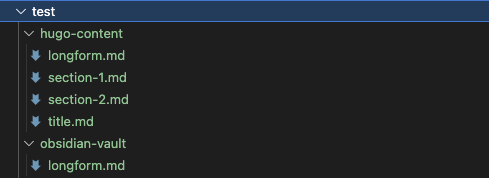

# The Longform Markdown Splitter

Splits and transforms markdown files from [Obsidian](https://obsidian.md/) for usage in [Hugo](https://gohugo.io).

* This thing ist done with [Typescript](https://www.typescriptlang.org/).
* Inspired by: https://github.com/accraze/split-md
* Why not [golang](https://golang.org/)? So you can use it easier outside the golang unsiverse.

## The Problem

* I have a long Markdown document that was compiled with the [Obsidian Longform plugin](https://github.com/kevboh/longform).
* I would like to make this available on my website.
* The website is built with [Hugo](https://gohugo.io).
* For this purpose, the longform document is to be split into several individual documents.
* Be Hugo compatible.
  * The individual documents should be equipped with frontmatter.
  * autogenerate uuids
* Certain content may need to be transformed:
  * Hugo shortcodes.
  * Remove TODOs.
  * Insert download buttons.
  * ...

It would be nice to be able to build customized transformers for different solutions.

## Further Requirements

* The splitting should be done on headings: e.g.: `# `
* The text of the heading is used as the filename
    * If necessary, with a number in front, if necessary replace special characters url conform
* Insert frontmatter and initialize correctly.
* Remove heading (preferably as an option)
* Replace images with shortcode, e.g:
    * Obsidian: `![[ein-bild.jpg]]`
    * Hugo replacement: ``.

## Restrictions

* Images and attachments must be provided separately for the time being. You can see in the console-output which files have been requested and where they should be reside. I will add a copy job that also automates this in near future. 
* However, the script provides information about which images and attachments it expects and where. 

## Install

The Transport-Scripts can be used in the Hugo-Project, or separately (what i recomend).

* create a `project-folder`
* open that folder, an in it...

```bash
npm init
# follow the guide
npm install longform-markdown-splitter
# check typescript installation
tsc --version
```

create a `tsconfig.json`

If u use it inside your Hugo Project, some folders are excluded per default.

```json
{
  "compilerOptions": {
    "module": "commonjs",
    "target": "ES5",
    "noImplicitAny": true,
    "removeComments": true,
    "preserveConstEnums": true,
    "sourceMap": false,
    "baseUrl": "./",
    "rootDir":"transport-scripts",
    "outDir": "transport-scripts-compiled"
  },
  "include": ["transport-scripts/**/*"],
  "exclude": [
    "assets",
    "config",
    "content",
    "data",
    "layouts",
    "node_modules",
    "resources",
    "static",
    "transport-scripts-compiled"
  ]
}
```

Create two folders for your scripts:

* `transport-scripts`
* `transport-scripts-compiled`

The first is for the Typescript source code, the second is for the Java script that will later be compiled from it.

## compile to javascript

To simplify handling, include the following build commands in the `package.json`: 

```json
    "build:ts": "rm -rf transport-scripts-compiled && tsc",
    "watch:ts": "tsc --watch",
```

## Create The Example Markdown-Files

* create folder `test`, and in folder test 
  * create folder `test/hugo-content/`
  * create folder `test/obsidian-fault/`

create a file `longform.md`and paste this in:

```md
# Title

Lorem ipsum dolor sit amet, consetetur sadipscing elitr, sed diam nonumy eirmod tempor invidunt ut labore et dolore magna aliquyam erat, sed diam voluptua. At vero eos et accusam et justo duo dolores et ea rebum. Stet clita kasd gubergren, no sea takimata sanctus est Lorem ipsum dolor sit amet. Lorem ipsum dolor sit amet.

- [ ] #TODO Some serious stuff to do...

Consetetur sadipscing elitr, sed diam nonumy eirmod tempor invidunt ut labore et dolore magna aliquyam erat, sed diam voluptua.

## A Chapter

Duis autem vel eum iriure dolor in hendrerit in vulputate velit esse molestie consequat, vel illum dolore eu feugiat nulla facilisis at vero eros et accumsan et iusto odio.

Ut wisi enim ad minim veniam, quis nostrud exerci tation ullamcorper suscipit lobortis nisl ut aliquip ex ea commodo consequat.   

# Section 1

Nam liber tempor cum soluta nobis eleifend option congue nihil imperdiet doming id quod mazim placerat facer possim assum.   

![[image-1.jpg]]

Duis autem vel eum iriure dolor in hendrerit in vulputate velit esse molestie consequat, vel illum dolore eu feugiat nulla facilisis.    

## Chapter 1.1

Consetetur sadipscing elitr, sed diam nonumy eirmod tempor invidunt ut labore et dolore magna aliquyam erat, sed diam voluptua.   

### Chapter 1.2.1

At vero eos et accusam et justo duo dolores et ea rebum. Stet clita kasd gubergren, no sea takimata sanctus est Lorem ipsum dolor sit amet.

### Chapter 1.2.2

Duis autem vel eum iriure dolor in hendrerit in vulputate velit esse molestie consequat, vel illum dolore eu feugiat nulla facilisis at vero eros et accumsan et iusto odio dignissim qui blandit praesent luptatum zzril delenit augue duis dolore te feugait nulla facilisi.

# Section 2

Ut wisi enim ad minim veniam, quis nostrud exerci tation ullamcorper suscipit lobortis nisl ut aliquip ex ea commodo consequat.  

## Chapter 2.1

Duis autem vel eum iriure dolor in hendrerit in vulputate velit esse molestie consequat, vel illum dolore eu feugiat nulla facilisis.   

![[image-2.jpg]]

Lorem ipsum dolor sit amet, consetetur sadipscing elitr, sed diam nonumy eirmod tempor invidunt ut labore et dolore magna aliquyam erat, sed diam voluptua. At vero eos et accusam et justo duo dolores et ea rebum. 

## Chapter 2.2

Duis autem vel eum iriure dolor in hendrerit in vulputate velit esse molestie consequat.

Duis autem vel eum iriure dolor in hendrerit in vulputate velit esse molestie consequat.

![[document-1.pdf]]

Consetetur sadipscing elitr, sed diam nonumy eirmod tempor invidunt ut labore et dolore magna aliquyam erat, sed diam voluptua.

Lorem ipsum dolor sit amet, consetetur sadipscing elitr, sed diam nonumy eirmod tempor invidunt ut labore et dolore magna aliquyam erat, sed diam voluptua.
```

## The Example Transport-Script

In folder `transport-scripts`create the file `split-my-longform.ts` and paste the code:

```js
import { MD_Splitter, type MD_Splitter_Parameter } from "longform-markdown-splitter";
import {MD_Frontmatter} from "longform-markdown-splitter";
import {
  ObsidianLink_Transformer,
  RemoveTODOS_Transformer,
  type MD_Transformer_Parameter
} from "longform-markdown-splitter";


let splitter: MD_Splitter = new MD_Splitter();

// Placeholder in the Transformers replace_template
// as pre defined in MD_Transformer_TemplateValues in the md-transformer module:
// {name_full} {name_suffix} {name}
var parameter_images: MD_Transformer_Parameter = {
  tag_obsidian_prefix:"![[",
  tag_obsidian_suffix: "]]",
  find_rule: "jpg|png",
  replace_template: `{{< image src="assets/images/{name_full}" >}}`
};

var parameter_docs: MD_Transformer_Parameter = {
  tag_obsidian_prefix:"![[",
  tag_obsidian_suffix: "]]",
  find_rule: "pdf|ods|odp",
  replace_template: `{{< button href="/getthis.php?id={name}" name="download {name} ({name_suffix})" >}}`
};

splitter.addTransformer(new ObsidianLink_Transformer(parameter_images));
splitter.addTransformer(new ObsidianLink_Transformer(parameter_docs));
splitter.addTransformer(new RemoveTODOS_Transformer("- [ ] #TODO "));

// The placeholders result from the definition of MD_FrontmatterType in md-frontmatter
var frontmatter:MD_Frontmatter = new MD_Frontmatter(`---
title: "{title}"
description: ""
url: /docs/{url_prefix}-{url}/
date: {date}
draft: false
images: []
menu:
  docs:
    parent: "docs-9602b15bad02600f3883f55e2ade6b81"
    identifier: "{url_prefix}-{url}-{uuid}"
weight: {weight}
toc: true
---\n\n`);

// Please adjust the parameters
let parameter: MD_Splitter_Parameter = {
  readPath:
    "test/obsidian-vault/longform.md",
  writePath: "test/hugo-content/",
  pattern: "# ",
  cleanName: "# ",
  limit: 100,
  hasCounter: true,
  weightBase: 8011,
  url_prefix: "my-prefix",
  doRemoveHeadline: true,
  frontmatter: frontmatter
};

splitter.split_longform(parameter);

```

## Compile The Transport-Script

The scripts can then be used as follows. In the terminal:

* `npm run build:ts` - build the library.
* `npm run watch:ts` - watch and compile on change to javascript.

The compiled files end up in the `transport-scripts-compiled` directory


## Run the Script in vscode

* In Visual Studio Code
* Go to the directory `transport-scripts-compiled`
* On the compiled `.js` file
* Mouse right klick -> Menu-Entry `Run Code`

Look in the `test` folder to check the result.



Observe the console output on the Output tab. The images and documents shown in the log have to be copied over manually at the moment. 


## Build A Custom Transformer 1

```ts
import { type MD_Transformer } from "./md-transformer";

class My_Transformer implements MD_Transformer {

  private find_rule = "";

  constructor(find_rule:string = "- [ ] "){
    this.find_rule = find_rule;
  }

  transform(source: string[], index: number): string | boolean | string[] {
    if (source[index].indexOf(this.find_rule) >= 0) {
      console.log(`Transform my stuff : ${source[index]}`);
      source.splice(index, 1);
      return true;
    } else {
      return false;
    }
  }
}
```

## Build A Custom Transformer 2

A second possibility is to derive from `ObsidianLink_Transformer_Base`. Then some of the preliminary work is already done: The parsing of prefix and suffix, to get the basic `template_values`.

```ts
import { type MD_Transformer } from "./md-transformer";

class ObsidianLink_Transformer extends ObsidianLink_Transformer_Base {

  transform(source: string[], index: number): string | boolean | string[] {
    super.transform(source, index);

    if (this.template_values.name_suffix.match(`^(${this.find_rule})$`)) {

      const hugo_template: MD_Template = new MD_Template(this.replace_template);

      source[index] = source[index].replace(
        this.tag,
        hugo_template.fill(this.template_values)
      );

    }

    return true;
  }
}
```